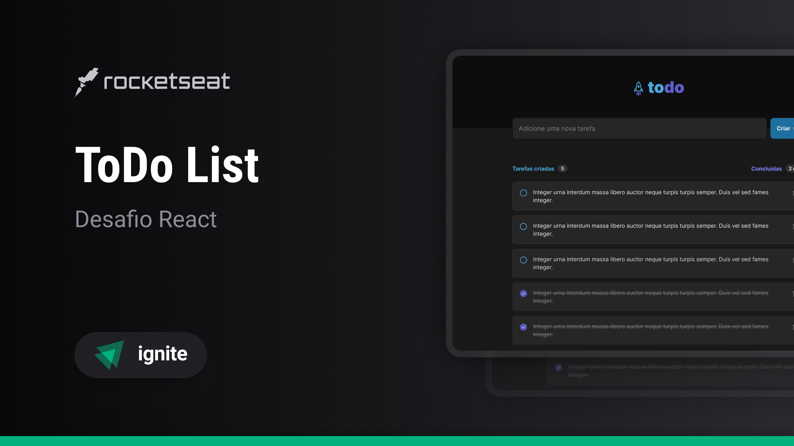

# Ignite ToDo

Projeto educacional pelo curso da [@Rocketseat](https://www.rocketseat.com.br/)

### Sobre

Uma aplicação de ToDo list para manter as suas tasks

### Estrutura

- Projeto criado em React com o framework [Vite](https://vitejs.dev/).
- A estrutura visual é feita pelo CSS MODULE do próprio React.
- Nesse projeto utilizo os Hooks do React para controlar os estados da aplicação.
